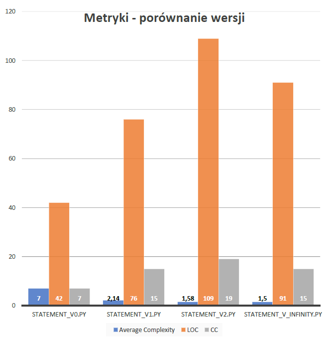

#### Uniwersytet Gdański - Informatyka NS II st. semestr 1. - 2019/2020

Tytuł: Refaktoryzacja kodu
-

Autor: Schonrock Janusz 246654
-
Link do repozytorium: https://github.com/johnnyrock92/zjp
-
---
## Kontekst
### Kod do refaktoryzacji został napisany w języku Python na podstawie kodu z książki [Refaktoryzacja. Ulepszanie struktury istniejącego kodu. Wydanie II](https://martinfowler.com/books/refactoring.html) Martina Fowlera (str. 18-19). Celem projektu jest refaktoryzacja kodu, czyli poprawienie jego struktury oraz zastosowanie konwencji przedstawionych w książce, które mają spowodować zwiększenie czytelności i jakości kodu.

---
## Opis programu
Stworzony program jest używany przez firmę zatrudniającą aktorów teatralnych do grania w różnych przedstawieniach. Klienci zamawiają przedstawienia, a firma wystawia rachunki uzależnione od przedstawienia i liczebności publiki. Do wyboru są dwa rodzaje przedstawień: tragedie i komedie. Firma również przyznaje punkty promocyjne, które można wymieniać na rabaty za przyszłe przedstawienia.

Aktorzy zapisują dane przedstawień w pliku ```plays.json```, dane do rachunku są zapisane w pliku ```invoices.json```.

---

## Metryki
## [```Wily```](https://wily.readthedocs.io/en/latest) / [```Radon```](https://radon.readthedocs.io/en/latest)
### Cyclomatic Complexity (CC)
|CC score|Rank|Risk 
|-|-|-
|1 - 5|A|low - simple block
|6 - 10|B|low - well structured and stable block
|11 - 20|C |moderate - slighltly complex block
|21 - 30|D|more than moderate - more complex block
|31 - 40|E|high - complex block, alarming
|41+|F|very high - error-prone, unstable block
|||

</br></br>

### Maintainability Index (MI)
|MI score|Rank|Maintainability
|-|-|-
|100 - 20| A |Very high
|19 - 10| B |Medium
|9 - 0| C |Extremely low
|||

## [```PyLint```](https://www.pylint.org) / [```Flake8```](http://flake8.pycqa.org/en/latest)
Wskazuje błędy w składni kodu.

## [```CodeFactor```](https://www.codefactor.io) / [```Better Code```](https://bettercodehub.com)
Narzędzia łączące cechy powyższych metryk i analizy składni pod kątem błędów.

[](https://www.codefactor.io/repository/github/johnnyrock92/zjp)
[](https://bettercodehub.com/)

---

## Proces refaktoryzacji
>### [```V0```](https://github.com/johnnyrock92/zjp/blob/master/V0)
>#### Metryki:
>+ Average complexity (CC): B (7.0)
>+ Lines of Code (LOC): 42
>+ Maintainability Index (MI): 65.97
>
>#### Code smells
>+ Powielony kod **(Duplicated Code)**
>+ Długa metoda **(Long Method)**


>### [```V1```](https://github.com/johnnyrock92/zjp/blob/master/V1)
>#### Metryki:
>+ Average complexity (CC): A (2.14)
>+ Lines of Code (LOC): 76
>+ Maintainability Index (MI): 72.16
>
>#### Dokonane refaktoryzacje:
> + Ekstrakcja metody **(Extract Method)**
>    - utworzenie funkcji openJsonFile()
>    - utworzenie funkcji amountFor()
>    - utworzenie funkcji playFor()
>    - utworzenie funkcji volumeCreditsFor()
>    - utworzenie funkcji totalVolumeCredits()
>    - utworzenie funkcji totalAmount()
>
> + Zmiana nazw zmiennych **(Rename Variable)**
>    - perf -> aPerformance
>    - użycie nazwy result w nowych funkcjach
>
> + Zmniejszenie liczby parametrów **(Remove Parameter)**
>    - usunięcie parametru play z funkcji amountFor()
>
> + Zastąpienie zmiennej tymczasowej zapytaniem **(Replace Temp with Query)**
>    - wchłonięcie zmiennej play i użycie w jej miejsce funkcji playFor()
>    - wchłonięcie zmiennej thisAmount i użycie w jej miejsce funkcji amountFor()
> + Podział pętli **(Split Loop)**
>   - totalVolumeCredits()
>   - totalAmount()
>
>#### Code smells
> + Skomplikowane instrukcje warunkowe **(Switch Statements)**

>### [```V2```](https://github.com/johnnyrock92/zjp/blob/master/V2)
>#### Metryki:
> + Average complexity (CC): A (1.58)
> + Lines of Code (LOC): 109
>+ Maintainability Index (MI): 61.93
>
>#### Dokonane refaktoryzacje:
> + Ekstrakcja metody **(Extract Method)**
>   - utworzenie funkcji renderPlainText()
>   - utworzenie funkcji run()
>   - rozłożenie instrukcji warunkowych poprzez utworzenie zagnieżdżonych funkcji comedy() oraz tragedy() w funkcji amountFor()
> + Włączenie funkcji do nowych klas **(Combine Functions into Class)**
>   - utworzenie klasy Statement
>   - utworzenie klasy ReadData
> + Zmiana nazw funkcji **(Rename Function)**
>   - konwencja z użyciem znaku podkreślenia: nazwa_nazwa()
>
>#### Code smells
> + Nadmiar komentarzy **(Comments)**
> + Pojemnik na dane **(Data Class)**


>### [```V3```](https://github.com/johnnyrock92/zjp/blob/master/V3)
>#### Metryki:
> + Average complexity (CC): A (1.5)
> + Lines of Code (LOC): 91
> + Maintainability Index (MI): 60.68
>
>#### Dokonane refaktoryzacje:
> + Ekstrakcja metody **(Extract Method)**
>   - przesunięcie nadmiernie skomentowanego fragmentu do funkcji switch()
> + Przeniesienie metody **(Move Method)**
>   - przeniesienie metody wczytywania danych do klasy Statement() i usunięcie klasy ReadData()
>
>#### Code smells
> + Nadmiernie rozbudowana klasa **(Large Class)**

>### [```V Infinity```](https://github.com/johnnyrock92/zjp/blob/master/V_Infinity/core)
>#### Metryki:
> |  | [statement.py](https://github.com/johnnyrock92/zjp/blob/master/V_Infinity/core/statement.py) | [calculate.py](https://github.com/johnnyrock92/zjp/blob/master/V_Infinity/core/calculate.py) | [render.py](https://github.com/johnnyrock92/zjp/blob/master/V_Infinity/core/render.py) | Średnio lub Suma
> | - | - | - | - | - |
> | Average complexity (CC) | A (1.25) | A (1.66) | A (2.0) | A (1.63)
> | Lines of Code (LOC) | 18 | 61 | 23 | 102
> | Maintainability Index (MI) | 100 | 74 | 91.16 | 88.38
>
>#### Dokonane refaktoryzacje:
> + Wydzielenie klasy **(Extract Class)**
>   - przeniesienie metod do nowych modułów z utworzonymi klasami Render oraz Calculate

<p align="center">
  
</p>
