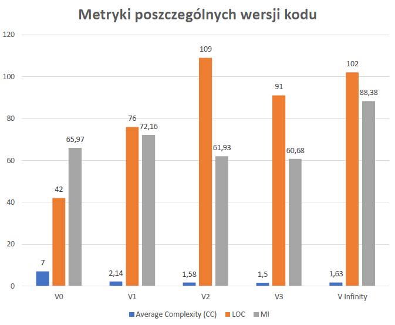

Uniwersytet Gdański - Informatyka NS II st. semestr 1. - 2019/2020
=
Autor: Schonrock Janusz 246654
-
Link: https://github.com/johnnyrock92/zjp
-
# Refaktoryzacja kodu
### Kod do refaktoryzacji został napisany w języku Python na podstawie kodu z książki [Refaktoryzacja. Ulepszanie struktury istniejącego kodu](https://martinfowler.com/books/refactoring.html) Martina Fowlera. Celem projektu jest refaktoryzacja kodu, czyli poprawienie jego struktury oraz zastosowanie konwencji przedstawionych w książce.

---
## Opis programu
Stworzony program jest używany przez firmę zatrudniającą aktorów teatralnych do grania w różnych przedstawieniach. Klienci zamawiają przedstawienia, a firma wystawia rachunki uzależnione od przedstawienia i liczebności publiki. Do wyboru są dwa rodzaje przedstawień: tragedie i komedie. Firma również przyznaje punkty promocyjne, które można wymieniać na rabaty za przyszłe przedstawienia.

Aktorzy zapisują dane przedstawień w pliku ```plays.json```, dane do rachunku są zapisane w pliku ```invoices.json```.

---

## Narzędzia
+ Wily
+ Radon
+ PyLint
+ Flake8
+ [](https://www.codefactor.io/repository/github/johnnyrock92/zjp)
---

## Proces refaktoryzacji
>### [```statement_v0.py```](https://github.com/johnnyrock92/zjp/blob/master/V0/statement_v0.py)
>#### Metryki:
>+ Average complexity: B (7.0)
>+ Lines of Code (LOC): 42
>+ Cyclomatic Complexity (CC): 7
>
>#### Code smells
>+ Powielony kod **(Duplicated Code)**
>+ Długa metoda **(Long Method)**


>### [```statement_v1.py```](https://github.com/johnnyrock92/zjp/blob/master/V1/statement_v1.py)
>#### Metryki:
>+ Average complexity: A (2.14)
>+ Lines of Code (LOC): 76
>+ Cyclomatic Complexity (CC): 15
>
>#### Dokonane refaktoryzacje:
> + Ekstrakcja metody **(Extract Method)**
>    - utworzenie funkcji openJsonFile()
>    - utworzenie funkcji amountFor()
>    - utworzenie funkcji playFor()
>    - utworzenie funkcji volumeCreditsFor()
>    - utworzenie funkcji totalVolumeCredits()
>    - utworzenie funkcji totalAmount()
>
> + Zmiana nazw zmiennych **(Rename Variable)**
>    - perf -> aPerformance
>    - użycie nazwy result w nowych funkcjach
>
> + Zmniejszenie liczby parametrów **(Remove Parameter)**
>    - usunięcie parametru play z funkcji amountFor()
>
> + Zastąpienie zmiennej tymczasowej zapytaniem **(Replace Temp with Query)**
>    - wchłonięcie zmiennej play i użycie w jej miejsce funkcji playFor()
>    - wchłonięcie zmiennej thisAmount i użycie w jej miejsce funkcji amountFor()
> + Podział pętli **(Split Loop)**
>   - totalVolumeCredits()
>   - totalAmount()
>
>#### Code smells
> + Skomplikowane instrukcje warunkowe **(Switch Statements)**

>### [```statement_v2.py```](https://github.com/johnnyrock92/zjp/blob/master/V2/statement_v2.py)
>#### Metryki:
> + Average complexity: A (1.58)
> + Lines of Code (LOC): 109
> + Cyclomatic Complexity (CC): 19
>
>#### Dokonane refaktoryzacje:
> + Ekstrakcja metody **(Extract Method)**
>   - utworzenie funkcji renderPlainText()
>   - utworzenie funkcji run()
>   - rozłożenie instrukcji warunkowych poprzez utworzenie zagnieżdżonych funkcji comedy() oraz tragedy() w funkcji amountFor()
> + Włączenie funkcji do nowych klas **(Combine Functions into Class)**
>   - utworzenie klasy Statement
>   - utworzenie klasy ReadData
> + Zmiana nazw funkcji **(Rename Function)**
>   - konwencja z użyciem znaku podkreślenia: nazwa_nazwa()
>
>#### Code smells
> + Nadmiar komentarzy **(Comments)**
> + Pojemnik na dane **(Data Class)**


>### [```statement_v_infinity.py```](https://github.com/johnnyrock92/zjp/blob/master/V_Infinity/statement_v_infinity.py)
>#### Metryki:
> + Average complexity: A (1.5)
> + Lines of Code (LOC): 91
> + Cyclomatic Complexity (CC): 15
>
>#### Dokonane refaktoryzacje:
> + Ekstrakcja metody **(Extract Method)**
>   - przesunięcie nadmiernie skomentowanego fragmentu do funkcji switch()
> + Przeniesienie metody **(Move Method)**
>   - przeniesienie metody wczytywania danych do klasy Statement() i usunięcie klasy ReadData()
---
## Porównanie wyników
<p align="center">
  
</p>